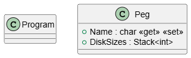

# Project Report: The Tower of Hanoi

**Course:** CRC-CD  
**Student Name:** Florian Golubic 
**Student ID:** cc241008 
**Date:** March 10, 2026

---

## 1. Introduction
This report outlines the implementation of a C# Console Application developed for CRC-CD UE. The primary objective of this application is to implement the Tower of Hanoi Game via Recursive and Iterative method.

## 2. System Architecture
The application is built using the .NET 10

[Software class diagram]


### 2.1 Component Overview
* **Program.cs:** Serves as the entry point and handles the main application lifecycle.
* **Hanoi implementation** Contains the methods and algorithms required to process the Tower of Hanoi.
* **Data Model:** Defines the structure of the objects used within the system.

### 2.2 Main program
If the user types in dotnet run, the program will response with "Usage: dotnet run -Recursive [numberOfDisks] or -Iterative [numberOfDisks]".
The program checks if argument paramter after dotnet run equals "-Recursive" or "-Iterative" then check if next argument exists and then try to parse it as integer, else the user gets informed to provide the number of disks after the parameter.
When the arguments have passed the check, the typed parameter will now be the number of total disks represented as int n.
Pass n to InitalizePegs function and then proceed with respective function call Recursive or Iterative
```csharp
static void Main(string[] args)
{
    for (int i = 0; i < args.Length; i++)
    {
        if (args[i].Equals("-Recursive", StringComparison.OrdinalIgnoreCase))
        {
            if (i + 1 < args.Length && int.TryParse(args[i + 1], out int n))
            {
                InitializePegs(n);
                Recursive(n, pegL, pegR, pegM);
                return;
            }
            else
            {
                Console.WriteLine("Error: Please provide the number of disks after -Recursive.");
                return;
            }
        }
        if (args[i].Equals("-Iterative", StringComparison.OrdinalIgnoreCase))
        {
            if (i + 1 < args.Length && int.TryParse(args[i + 1], out int n))
            {
                InitializePegs(n);
                Iterative(n, pegL, pegR, pegM);
                return;
            }
            else
            {
                Console.WriteLine("Error: Please provide the number of disks after -Iterative.");
                return;
            }
        }
    }

    Console.WriteLine("Usage: dotnet run -Recursive [numberOfDisks] or -Iterative [numberOfDisks]");
}
```
### 2.3 InitializePegs function
This function is used to initialize the pegs and fill the source (left) peg with n disks.
During initialization Stack DiskSizes of pegL will be filled with the disks.
Call DrawBoard function for drawing the starting position as ASCII-Art in the terminal.
```csharp
static void InitializePegs(int n)
{
    totalDisks = n;
    pegL.DiskSizes.Clear();
    pegM.DiskSizes.Clear();
    pegR.DiskSizes.Clear();

    // Initialize the source peg with disks
    for (int i = n; i > 0; i--)
    {
        pegL.DiskSizes.Push(i);
    }
    
    // Initial starting state
    DrawBoard();
}
```

## 3. Implementation Details
The project uses two implementation functions (Recursive, Iterative) to create the Tower of Hanoi algorithm using multiple features like classes, stack management for the pegs and multiple ASCII Methods for drawing the Disks including animation

### 3.1 Recursive algorithm
The following code snippet demonstrates the core logic for Recursive:

```csharp
static void Recursive(int n, Peg source, Peg dest, Peg spare)
{
    if (n == 0)
        return;

    // Move all disks smaller than this current to the spare.
    Recursive(n - 1, source, spare, dest);

    // Move disk to the destination peg
    int disk = source.DiskSizes.Pop();
    dest.DiskSizes.Push(disk);
    PrintDiskMovement(disk, source.Name, dest.Name);
    DrawBoard(); // Draw the board after the move

    // Move disk from the spare back to the dest peg.
    Recursive(n - 1, spare, dest, source);
}
```

### 3.2 Iterative algorithm
The following code snippet demonstrates the core logic for Recursive:
- Paramters :
  - n - int - total number of disks which is set by the user via command line (default = 3)
  - source - Peg - starting point from where the disks originate, is set in main
  - dest - Peg - the destination to which the disks will be moving (from source peg to dest peg)
  - spare - Peg - represents the peg not involved in diskMovement
```csharp
static void Iterative(int n, Peg source, Peg dest, Peg spare)
{
    // If the total number of disks is even, swap destination and spare
    // ensures that the disks will be built on the right peg 
    if (n % 2 == 0)
    {
        // tuple deconstruction
        (spare, dest) = (dest, spare);
    }

    int totalMoves = (int)Math.Pow(2, n) - 1;

    for (int i = 1; i <= totalMoves; i++)
    {
        
        if (i % 3 == 1) // odd numbered moves 
            MoveBetweenPegs(source, dest);
        else if (i % 3 == 2)
            MoveBetweenPegs(source, spare);
        else if (i % 3 == 0)
            MoveBetweenPegs(spare, dest);
    }
}
```
#### 3.2.1 MoveBetweenPegs function
The following code snippets demonstrates the core logic of the function MoveBetweenPegs.
- Parameters:
  - peg1 - Peg - must contain one of the Peg you want to check if disk movement is possible
  - peg2 - Peg - other Peg to check if disk movement is possible 
```csharp
static void MoveBetweenPegs(Peg peg1, Peg peg2)
{
    // If peg 1 is empty, peg 2 top disk must move to peg 1
    if (peg1.DiskSizes.Count == 0)
    {
        int disk = peg2.DiskSizes.Pop();
        peg1.DiskSizes.Push(disk);
        PrintDiskMovement(disk, peg2.Name, peg1.Name);
    }
    // If peg 2 is empty, move peg 1 top disk to peg 2
    else if (peg2.DiskSizes.Count == 0)
    {
        int disk = peg1.DiskSizes.Pop();
        peg2.DiskSizes.Push(disk);
        PrintDiskMovement(disk, peg1.Name, peg2.Name);
    }
    // If both have disks, compare the top disks
    else
    {
        int topDisk1 = peg1.DiskSizes.Peek();
        int topDisk2 = peg2.DiskSizes.Peek();

        if (topDisk1 < topDisk2)
        {
            peg1.DiskSizes.Pop();
            peg2.DiskSizes.Push(topDisk1);
            PrintDiskMovement(topDisk1, peg1.Name, peg2.Name);
        }
        else
        {
            peg2.DiskSizes.Pop();
            peg1.DiskSizes.Push(topDisk2);
            PrintDiskMovement(topDisk2, peg2.Name, peg1.Name);
        }
    }
            
    DrawBoard();
}
```

## 4. Relevant classes
This section covers the most important class and its main use in the program

### 4.1 Peg class
Primary constrcutor with the parameter of char name
- Fields:
  - Name - char - saves the name of the Peg ('L', 'M' or 'R')
  - DiskSizes - Stack of type int - contains all disk currently on the peg
```csharp
public class Peg(char name)
{
    public char Name { get; set; } = name;
    public Stack<int> DiskSizes { get; } = new Stack<int>();
}
```